# Fennec Architecture

```mermaid
%%{init: {'theme': 'dark', 'themeVariables': { 'primaryColor': '#1a1a2e', 'primaryTextColor': '#e0e0e0', 'primaryBorderColor': '#ff6432', 'lineColor': '#ff6432', 'secondaryColor': '#16213e', 'tertiaryColor': '#0f3460' }}}%%

graph TB
    %% ─── MCP Client Layer ───
    subgraph Clients["🧠 AI / MCP Clients"]
        Claude["Claude Desktop"]
        Cursor["Cursor / Windsurf"]
        Cline["Cline / Continue.dev"]
    end

    %% ─── CLI Layer ───
    subgraph CLI["🖥️ CLI Package (packages/cli)"]
        FennecStart["fennec start
(start MCP server)"]
        FennecPipe["fennec pipe --name
(pipe stdout/stderr)"]
        FennecAttachPid["fennec attach-pid
(attach by PID)"]
        FennecAttachPort["fennec attach-port
(attach by port)"]
        FennecWatch["fennec watch
(watch log file)"]
        FennecInit["fennec init/setup
(config generation)"]
        FennecBrowsers["fennec install-browsers
(install Playwright)"]
    end

    %% ─── Transport Layer ───
    subgraph Transport["🔌 Transport Layer"]
        STDIO["stdio (default)"]
        SSE["SSE (experimental)"]
    end

    %% ─── Core Server ───
    subgraph Server["🦊 Fennec MCP Server"]
        direction TB

        ToolReg["📦 Tool Registry\n112 tools · 15 categories"]
        Validate["✅ Input Validation\nZod Schemas"]

        %% Middleware Pipeline
        subgraph Pipeline["⛓️ Middleware Pipeline"]
            direction LR
            TM["Telemetry\n(durations, memory)"]
            AL["Audit Log\n(every call)"]
            PG["Permission Guard\n(sandbox, allowlists)"]
            SM["State Machine\n(auto-transitions)"]
            SH["Smart Hook\n(selector fallback)"]
            RH["Retry Handler\n(max 2 retries)"]
            TM --> AL --> PG --> SM --> SH --> RH
        end

        %% Core Services
        subgraph Services["⚙️ Core Services"]
            SessMgr["SessionManager\nbrowser sessions, tabs,\nmulti-context"]
            ProcMgr["ProcessManager\nspawn, kill, attach,\npipe, restart"]
            Planner["Planner\ngoal → multi-step\nplan generation"]
            WfEngine["WorkflowEngine\nplanToWorkflow,\nexecutePlan"]
            WfSched["WorkflowScheduler\nauto-trigger rules,\nevent matching"]
            EventBus["EventBus\npub/sub, timeline,\npruning"]
            ResMgr["ResourceManager\nhealth checks,\nauto-cleanup"]
            Recorder["Recorder\nsession replay"]
            StateMgr["StateManager\ncontext switch\ndetection"]
            CapDetect["CapabilityDetector\nframework detection\n(Next, React, Vue)"]
            PerfMetrics["PerformanceMetrics\nself-observability"]
        end

        %% Correlation Engine
        subgraph Correlation["🔗 Cross-Layer Correlation Engine"]
            CorrTimeline["Timeline Builder\nevent sequencing"]
            CorrInfer["Root Cause Inferrer\n6+ pattern rules,\nconfidence scoring"]
        end
    end

    %% ─── Browser Layer ───
    subgraph Browser["🌐 Browser Layer (Playwright)"]
        direction TB
        BrowserEngines["Browser Engines\nChromium · Firefox · WebKit"]
        CDP["Chrome DevTools Protocol"]
        ConsoleCol["Console Collector\n(logs, errors, warnings)"]
        NetworkCol["Network Collector\n(requests, responses,\nintercept, mock)"]
        PerfCol["Performance Collector\n(FCP, LCP, CLS, TBT,\nmemory, profiling)"]
        CdpStorage["Storage Inspector\n(localStorage, cookies,\nIndexedDB, sessionStorage)"]
        DOM["DOM Inspector\n(snapshot, accessibility,\nShadow DOM)"]
        Interaction["Interaction Engine\n(click, type, select,\nhover, drag-drop, scroll)"]
    end

    %% ─── Process Layer ───
    subgraph Process["🖥️ Process Layer"]
        direction TB
        ChildProc["child_process\n(spawn, kill, stdin)"]
        LogWatcher["Log Watcher\n(tail files, level\ndetection)"]
        PipeWatcher["Pipe Watcher\n(stdout/stderr pipes)"]
        PortDetect["Port Detector\n(find process by\nPID or port)"]
    end

    %% ─── Storage Layer ───
    subgraph Storage["💾 Storage Layer"]
        SessStore["Session Store\n(auth sessions,\ncookies + localStorage)"]
        WfStorage["Workflow Store\n(workflow definitions,\nexecution history)"]
        FileSystem["File System\n(screenshots, exports,\nHAR files, config)"]
    end

    %% ─── Tool Categories ───
    subgraph Tools["🔧 Tool Categories (112 tools)"]
        direction LR
        Nav["Navigation\n6 tools"]
        Int["Interaction\n10 tools"]
        DOMCat["DOM\n9 tools"]
        DevCon["Console\n5 tools"]
        DevNet["Network\n9 tools"]
        DevPerf["Performance\n6 tools"]
        Stor["Storage\n12 tools"]
        AuthCat["Auth\n6 tools"]
        TabCat["Tabs\n7 tools"]
        ProcCat["Process\n10 tools"]
        TermCat["Terminal\n7 tools"]
        DiagCat["Diagnostic\n6 tools"]
        SchedCat["Scheduler\n7 tools"]
        SmartCat["Smart\n7 tools"]
        PlanCat["Planner\n5 tools"]
    end

    %% ─── Data Flow Connections ───

    %% Clients → Transport
    Clients -->|"MCP Protocol (JSON-RPC)"| STDIO
    Clients -->|"MCP Protocol (JSON-RPC)"| SSE

    %% Transport → Server
    STDIO --> ToolReg
    SSE --> ToolReg
    ToolReg --> Validate
    Validate --> Pipeline

    %% Pipeline → Services
    Pipeline -->|"tool context"| SessMgr
    Pipeline -->|"tool context"| ProcMgr
    Pipeline -->|"tool context"| Planner
    Pipeline -->|"tool context"| WfEngine
    Pipeline -->|"tool context"| WfSched
    Pipeline -->|"tool context"| EventBus
    Pipeline -->|"tool context"| ResMgr
    Pipeline -->|"tool context"| Recorder
    Pipeline -->|"tool context"| StateMgr
    Pipeline -->|"tool context"| CapDetect
    Pipeline -->|"record metrics"| PerfMetrics

    %% SmartHook → Browser (for fallback selector recovery)
    SH -.->|"fallback selectors"| DOM

    %% EventBus → WorkflowScheduler (auto-trigger)
    EventBus -->|"events"| WfSched

    %% WorkflowScheduler → WorkflowEngine
    WfSched -->|"trigger workflow"| WfEngine

    %% Planner → WorkflowEngine
    Planner -->|"plan"| WfEngine

    %% Core Services → Browser Layer
    SessMgr -->|"Playwright API"| Browser
    Pipeline -->|"tool calls"| Browser
    Pipeline -->|"tool calls"| Process

    %% CDP Collectors
    CDP --> ConsoleCol
    CDP --> NetworkCol
    CDP --> PerfCol
    CDP --> CdpStorage
    CDP --> DOM
    CDP --> Interaction

    %% Browser → CDP
    BrowserEngines -->|"CDP Session"| CDP

    %% Correlation Engine
    ConsoleCol -->|"console events"| EventBus
    NetworkCol -->|"network events"| EventBus
    LogWatcher -->|"log events"| EventBus
    PipeWatcher -->|"pipe events"| EventBus
    ProcMgr -->|"process events"| EventBus

    EventBus -->|"timeline"| CorrTimeline
    CorrTimeline --> CorrInfer

    %% Storage
    SessMgr -->|"save/load"| SessStore
    WfEngine -->|"persist"| WfStorage
    SessStore --> FileSystem
    WfStorage --> FileSystem

    %% Process Layer Details
    ProcMgr --> ChildProc
    ProcMgr --> LogWatcher
    ProcMgr --> PipeWatcher
    ProcMgr --> PortDetect

    %% Tools → Categories (logical grouping)
    ToolReg -.-> Nav
    ToolReg -.-> Int
    ToolReg -.-> DOMCat
    ToolReg -.-> DevCon
    ToolReg -.-> DevNet
    ToolReg -.-> DevPerf
    ToolReg -.-> Stor
    ToolReg -.-> AuthCat
    ToolReg -.-> TabCat
    ToolReg -.-> ProcCat
    ToolReg -.-> TermCat
    ToolReg -.-> DiagCat
    ToolReg -.-> SchedCat
    ToolReg -.-> SmartCat
    ToolReg -.-> PlanCat

    %% ─── Styles ───
    classDef client fill:#1a1a2e,stroke:#ff6432,stroke-width:2px,color:#e0e0e0;
    classDef transport fill:#16213e,stroke:#4a90d9,stroke-width:2px,color:#e0e0e0;
    classDef server fill:#1a1a2e,stroke:#ff6432,stroke-width:2px,color:#e0e0e0;
    classDef pipeline fill:#0f3460,stroke:#e94560,stroke-width:2px,color:#e0e0e0;
    classDef service fill:#16213e,stroke:#4a90d9,stroke-width:2px,color:#e0e0e0;
    classDef correlation fill:#533483,stroke:#e94560,stroke-width:2px,color:#e0e0e0;
    classDef browser fill:#1a1a2e,stroke:#44cc44,stroke-width:2px,color:#e0e0e0;
    classDef process fill:#1a1a2e,stroke:#ffaa00,stroke-width:2px,color:#e0e0e0;
    classDef storage fill:#16213e,stroke:#8888ff,stroke-width:2px,color:#e0e0e0;
    classDef tools fill:#0f3460,stroke:#ff6432,stroke-dasharray: 3 3,color:#e0e0e0;

    class Claude,Cursor,Cline client;
    class STDIO,SSE transport;
    class ToolReg,Validate server;
    class TM,AL,PG,SM,SH,RH pipeline;
    class SessMgr,ProcMgr,Planner,WfEngine,WfSched,EventBus,ResMgr,Recorder,StateMgr,CapDetect,PerfMetrics service;
    class CorrTimeline,CorrInfer correlation;
    class BrowserEngines,CDP,ConsoleCol,NetworkCol,PerfCol,CdpStorage,DOM,Interaction browser;
    class ChildProc,LogWatcher,PipeWatcher,PortDetect process;
    class SessStore,WfStorage,FileSystem storage;
    class Nav,int,DOMCat,DevCon,DevNet,DevPerf,Stor,AuthCat,TabCat,ProcCat,TermCat,DiagCat,SchedCat,SmartCat,PlanCat tools;
```



---

## Layer Overview

| Layer | Components | Description |
|-------|------------|-------------|
| **🧠 AI Clients** | Claude, Cursor, Cline, etc. | Standard MCP clients that communicate via JSON-RPC |
| **🔌 Transport** | stdio, SSE | Two transport modes — stdio (default, for local CLI) and SSE (experimental, for HTTP) |
| **🦊 MCP Server** | Tool Registry, Validation, Pipeline | Core server that registers 112 tools, validates input via Zod, and executes through middleware |
| **⚙️ Services** | 11 core services | Session, process, planner, workflow, scheduler, event bus, resource, recorder, state, capability, metrics |
| **📱 Mobile** | ADB via child_process | Android device management: device discovery, tap, type, swipe, logcat, screenshot, app install/launch/stop |
| **🔗 Correlation** | Timeline, Root Cause Inferrer | Cross-layer event correlation with confidence scoring and suggested fixes |
| **🌐 Browser** | Playwright + CDP | Full browser automation: Chromium/Firefox/WebKit, console, network, performance, DOM, storage |
| **🖥️ Process** | child_process, watchers | Process management: spawn, kill, attach by PID/port, log watching, pipe monitoring |
| **💾 Storage** | Sessions, Workflows, Files | Persistent storage for auth sessions, workflow definitions, screenshots, and exports |

## Request Flow

```
AI Agent → MCP Transport → Tool Registry → Zod Validation
  → Middleware Pipeline → Core Service → Browser/Process Layer
  → Response → AI Agent
```

### Detailed Flow

1. **AI Agent** sends a JSON-RPC `tools/call` request via MCP protocol
2. **Transport** (stdio or SSE) receives the request
3. **Tool Registry** looks up the tool by name (112 tools, 15 categories)
4. **Zod Validation** parses and validates the input parameters
5. **Middleware Pipeline** executes in order:
   - `Telemetry` — records call duration, updates performance metrics
   - `Audit Log` — logs every tool call with timestamp, session, input
   - `Permission Guard` — checks sandbox, allowlists, permissions
   - `State Machine` — auto-transitions browser state based on tool type
   - `Smart Hook` — retries with fallback selectors on ELEMENT_NOT_FOUND
   - `Retry Handler` — retries on transient failures (max 2)
6. **Core Service** executes the tool logic (SessionManager, ProcessManager, etc.)
7. **Browser/Process Layer** performs the actual action (Playwright / child_process)
8. **Response** flows back through the pipeline to the AI agent

## Key Architecture Decisions

### Optional Browser Dependency
Playwright is an **optional peer dependency**. The Process, Terminal, Scheduler, Planner, and basic Storage/Auth/Diagnostic tools (53 tools) work without browser engines installed.

### Middleware Pipeline Pattern
All tool calls pass through the same middleware pipeline for consistent observability, security, and error recovery. Middleware can short-circuit (e.g., Permission Guard blocks disallowed operations) or augment (e.g., Smart Hook adds fallback selectors).

### Event-Driven Auto-Diagnosis
The EventBus connects browser events (console errors, network failures) and process events (log output, pipe data) to the WorkflowScheduler, which auto-triggers diagnostic workflows based on configurable rules.

### Module System (FennecModule + ModuleRegistry)

Fennec uses a modular architecture where each domain (browser, mobile, process) is encapsulated in a `FennecModule`:

```typescript
interface FennecModule {
  name: string;
  description: string;
  tools: ToolDefinition[];
  capabilities?: string[];
  initialize?(context: ModuleContext): Promise<void>;
  cleanup?(): Promise<void>;
}
```

Modules are registered via `ModuleRegistry` and their tools are auto-discovered:

```typescript
const registry = new ModuleRegistry();
registry.register(browserModule);
registry.register(processModule);
registry.register(mobileModule);

// Register all tools from all modules
registry.registerAllTools(toolRegistry);
```

New modules can be added by creating a class/object that implements `FennecModule` and registering it — no need to modify the core server.

### BrowserEngine Abstraction

All browser tools access the browser through the `BrowserSession` interface — not Playwright directly:

```typescript
// Before (tight coupling to Playwright)
session.page.goto(url);
session.page.click(selector);
session.cdpSession.send(method);

// After (abstracted)
session.browser.navigate(url);
session.browser.locator(selector).click();
session.browser.cdp().send(method);
```

This allows swapping the browser engine (Playwright → Puppeteer → CDP Direct) without modifying any tool handlers.

### Modular Categories
Tools are grouped into 16 categories that MCP clients can request individually to reduce context window usage. Each tool belongs to exactly one category.
